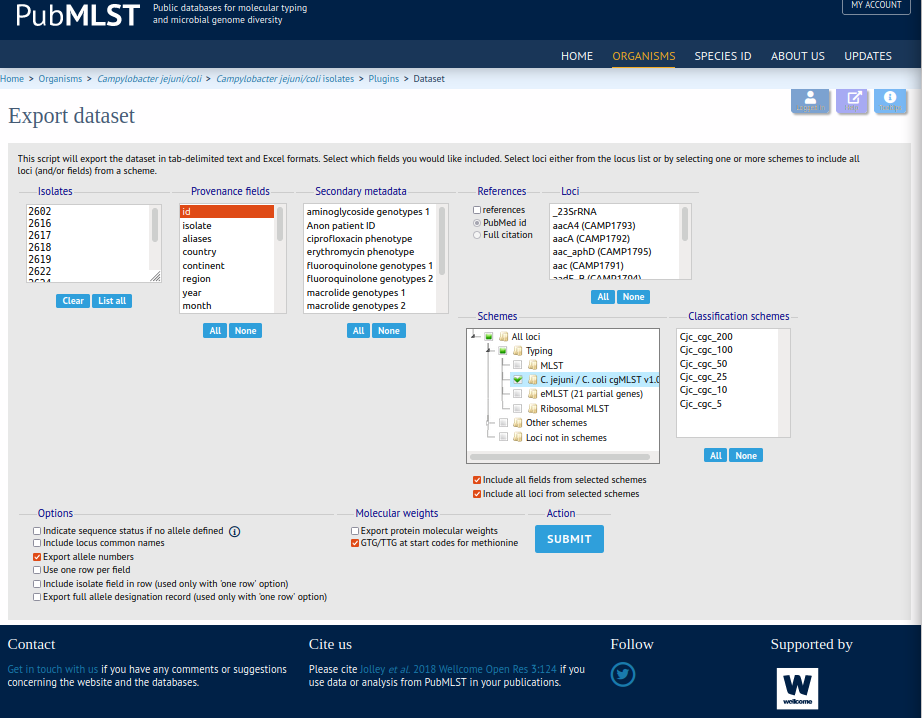

# aiSource
### Introduction
Repository for the paper ["Machine learning to predict the source of campylobacteriosis using whole genome data"](https://doi.org/10.1101/2021.02.23.432443 )

This repository allows you to attribute sources of human campylobacter from core-genome multi-locus-sequence-type ([cgMLST](https://doi.org/10.1128/JCM.00080-17 )) data. The algorithm is named **aiSource** after the previously most commonly used [iSource](https://doi.org/10.1371/journal.pgen.1000203). The accuracy of this prediction should be ~84% based on realistic source composition in human cases, for a more thorough investigation of performance please consult the paper.

The different files in this repository do the following.

* aiSource_prediction.py - The python script allowing you to predict sources
* aiSource_classifier_object.p - A pickle object containing the XGBoost classifier trained in our paper
* test_data.tsv - a file containing test cgMLST files in a tab delimited format
* test_aiSource_out.tsv - the corresponding output file to the test data
* requirements.txt - test file containing all required python packages. Further down we explain how to set this up

### Dataset acquisition
Using aiSource you can conveniently predict any human campylobacter cgMLST samples. Campylobacter sources can be downloaded from the fantastic [pubmlst](pubmlst.org) database. Specifically for campylobacter [here](https://pubmlst.org/bigsdb?db=pubmlst_campylobacter_isolates&l=1&page=query). At the bottom of the page you can export the samples using the field "Dataset" next to the Export field with the little save icon. This brings you to the Export dataset field where you can choose as many provenance fields as you want just make sure you include id and under "Schemes" you choose All loci>Typing>C. Jejuni/C. coli cgMLST v1.0 as shown below.

The resulting table should be saved with "Export table(text)" and can now be used for the prediction!

If instead you want to use the dataset we used in the paper you can find it [here](https://pubmlst.org/bigsdb?db=pubmlst_campylobacter_isolates&page=query&project_list=102&submit=1). 

Otherwise if you have whole genomes from campy you can upload a fasta of the genome get the corresponding cgMLST patterns [here](https://pubmlst.org/bigsdb?db=pubmlst_campylobacter_seqdef&l=1&page=batchSequenceQuery). Please choose the C. jejuni. C.coli cgMLST v1.0 in the "Please select locus/scheme" menu. The resulting table should again be saved with "Export table(text)".

### Setting up the prediction
first you should download this repository with 
    git clone https://github.com/narning1992/aiSource.git
then change into the folder you just downloaded
    cd iSource

this is where you will do the analysis so your input files should also be stored in this folder. 

In order to run aiSource you will need to install a few packages and make sure that you got python 3 installed. Depending on your preferred package manager you can do the following

for pip use 
    pip install -r requirements.txt
(this is the most straightforward. See [here](https://pip.pypa.io/en/stable/installing/)
for conda use
    conda create --name aiSource python=3.8
    conda activate aiSource
    conda install --file requirements.txt
for virtualenv 
    virtualenv --python=python3.8 aisource
    source aisource/bin/activate
    pip install -r requirements.txt

That should do the trick.

### Source attribution using aiSource
Now that all packages are installed you can simply predict your cgMLST files like this
    python3 aiSource_prediction.py -i <path to the cgMLST file you downloaded from pubMLST> -n <prefix for your output file>

You could do a test run with the data we provided like this:
    python3 aiSource_prediction.py -i test_data.tsv -n test

The output file will be created in the same folder under `<prefix>_aiSource_out.tsv`

### Interpreting the output
The output has 7 columns. The "id" columns contains the identifier specified in the input file under id. The "predicted_source" column contains the source predicted by aiSource. The following columns contain the predicted probabilities across all sources which sum up to 1.

